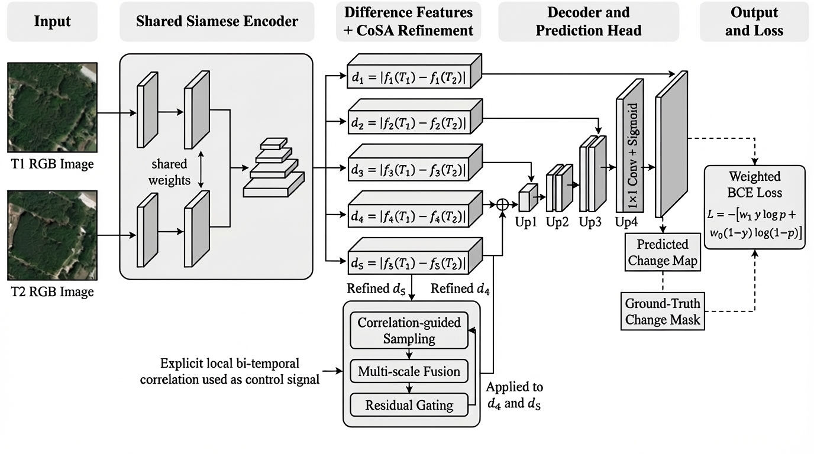

# CoSA: Correlation-Guided Change Attention with Learnable Residual Gating for Remote Sensing Change Detection

This repository contains the code, experiment assets, and reproducibility materials for **CoSA**, a lightweight decoder-side refinement module for bi-temporal remote sensing change detection.

**Status:** Accepted for publication in **IEEE Access**.



## Overview

CoSA improves Siamese change detection by using explicit bi-temporal feature correlation to guide context sampling, multi-scale aggregation, and learnable residual gating. The repository includes Open-CD-style experiment configs, ablation artifacts, and figure/table generation scripts used to support the paper.

## Paper Status

The paper has been accepted in **IEEE Access**. The official IEEE article link and DOI can be added here once the publication page is live.

## Repository Structure

| Path | Purpose |
|------|---------|
| `configs/custom/` | Standalone CoSA and baseline configs used during method development. |
| `configs/opencd/` | Open-CD-style model configs used for integration and benchmarking. |
| `models/` | Model wrappers, standalone experiments, and selected logs/checkpoints kept with the repo. |
| `scripts/` | Figure generation, table generation, and analysis utilities referenced by the paper. |
| `ablation/` | Ablation study logs, summaries, tables, and qualitative outputs. |
| `figures/` | Repository-level figures used in documentation and analysis. |
| `data/LEVIR-CD/README.md` | Expected dataset folder structure placeholder for LEVIR-CD. |

## Benchmarks Covered

The paper reports results on:

- LEVIR-CD
- S2Looking
- DSIFN
- CLCD

## Reproducibility Notes

This public repository is intentionally lighter than the full internal research workspace.

- Included: configs, analysis scripts, ablation artifacts, and selected experiment logs/checkpoints.
- Excluded: full datasets, large training outputs, most checkpoints, and local `results/` or `work_dirs/` directories.
- The Open-CD-style configs in `configs/opencd/` are the main entry points for reproducing the reported experiments once the required datasets and dependencies are prepared locally.

## Citation

If this repository contributes to your work, please cite the accepted IEEE Access paper.

```bibtex
@article{omar2026cosa,
  title   = {CoSA: Correlation-Guided Change Attention with Learnable Residual Gating for Remote Sensing Change Detection},
  author  = {Omar, Abdirashid and Park, Jonghyuk},
  journal = {IEEE Access},
  year    = {2026},
  note    = {Accepted for publication}
}
```

Additional repository metadata is available in [`CITATION.cff`](CITATION.cff).

## License

This project is released under the MIT License. See [`LICENSE`](LICENSE).

## Contact

- Abdirashid Omar, Kookmin University
- Jonghyuk Park, Kookmin University
